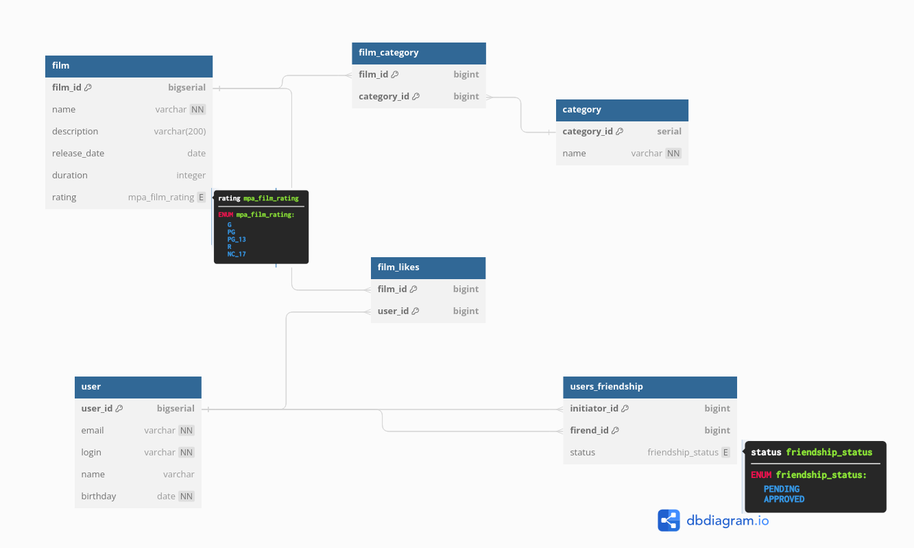

# java-filmorate

Template repository for Filmorate project.

## Схема базы данных



```sql
CREATE TYPE mpa_film_rating AS ENUM (
  'G',
  'PG',
  'PG_13',
  'R',
  'NC_17'
);

CREATE TYPE friendship_status AS ENUM (
  'PENDING',
  'APPROVED'
);

CREATE TABLE film (
  film_id bigserial PRIMARY KEY,
  name varchar NOT NULL,
  description varchar(200),
  release_date date,
  duration integer,
  rating mpa_film_rating
);

CREATE TABLE category (
  category_id serial PRIMARY KEY,
  name varchar NOT NULL
);

CREATE TABLE film_category (
  film_id bigint,
  category_id bigint,
  PRIMARY KEY (film_id, category_id),
  CONSTRAINT fc_fk_film
    FOREIGN KEY(film_id) 
      REFERENCES film(film_id) ON DELETE CASCADE,
  CONSTRAINT fc_fk_category
    FOREIGN KEY(category_id) 
      REFERENCES category(category_id) ON DELETE CASCADE
);

CREATE TABLE "user" (
  user_id bigserial PRIMARY KEY,
  email varchar NOT NULL,
  login varchar NOT NULL,
  name varchar,
  birthday date NOT NULL
);


CREATE TABLE film_likes (
  film_id bigint,
  user_id bigint,
  PRIMARY KEY (film_id, user_id),
  CONSTRAINT fl_fk_film_id
    FOREIGN KEY(film_id) 
      REFERENCES film(film_id) ON DELETE CASCADE,
  CONSTRAINT fl_fk_user_id
    FOREIGN KEY(user_id) 
      REFERENCES "user"(user_id) ON DELETE CASCADE
);

CREATE TABLE users_friendship (
  initiator_id bigint,
  friend_id bigint,
  status friendship_status,
  PRIMARY KEY (initiator_id, friend_id),
  CONSTRAINT uf_fk_initiator
      FOREIGN KEY(initiator_id) 
        REFERENCES "user"(user_id) ON DELETE CASCADE,
  CONSTRAINT uf_fk_friend
    FOREIGN KEY(friend_id) 
      REFERENCES "user"(user_id) ON DELETE CASCADE
);
```

### `film`

Содержит информацию о фильмах.

Таблица состоит из полей:

- первичный ключ `film_id` — идентификатор фильма;
- `name` — название фильма;
- `description` — описание фильма;
- `release_date` — дата выхода;
- `duration` — продолжительность фильма в минутах;
- `rating` — возрастной рейтинг, например:
    - `PG` — детям рекомендуется смотреть такой фильм с родителями;
    - `PG-13` — детям до 13 лет смотреть такой фильм нежелательно.

### `category`

Содержит информацию о категориях фильмов.

Таблица состоит из полей:

- первичный ключ `category_id` — идентификатор категории;
- `name` — название фильма;

### `film_category`

Содержит информацию о категориях фильмов из таблицы film.

Таблица состоит из полей:

- `film_id` —идентификатор фильма из film;
- `category_id` — идентификатор категории из category;

В этой таблице составной первичный ключ по полям film_id и category_id

### `film_likes`

Содержит информацию о лайках к фильмам из таблицы film.

Таблица состоит из полей:

- `film_id` — идентификатор фильма из film;
- `user_id` — идентификатор пользователя из user;

В этой таблице составной первичный ключ по полям film_id и user_id

### `user`

Содержит информацию о пользователях.

Таблица состоит из полей:

- первичный ключ `user_id` — идентификатор пользователя;
- `email` — email пользователя [уникальное не нулевое поле];
- `login` — login пользователя [уникальное не нулевое поле];
- `name` — имя пользователя;
- `birthday` — дата рождения;

### `users_friendship`

Содержит информацию о друзьях.

Таблица состоит из полей:

- `initiator_id` — пользователь, который отправил запрос на добавление в друзья;
- `friend_id` — пользователь которому отправлен запрос в друзья;
- `status` — статус запроса:
    - `PENDING` — ожидается подтверждение;
    - `APPROVED` — подтверждено.

## Примеры запросов к бд

Запрос списка друзей пользователя с id = 1:

```sql
SELECT u.user_id,
       u.name,
       u.email,
       u.login
FROM (SELECT initiator_id AS user_id
      FROM users_friendship
      WHERE initiator_id = 1 OR friend_id = 1 AND status = 'APPROVED'

      UNION

      SELECT friend_id AS user_id
      FROM users_friendship
      WHERE initiator_id = 1 OR friend_id = 1 AND status = 'APPROVED') AS users_list
LEFT JOIN "user" AS u ON u.user_id = users_list.user_id
WHERE users_list.user_id != 1;
```

Запрос списка пользователей лайкнувших фильм с id = 1:

```sql
SELECT u.user_id,
       u.name,
       u.email
FROM film AS f
LEFT JOIN film_likes AS fl on f.film_id = fl.film_id
LEFT JOIN "user" AS u on u.user_id = fl.user_id
WHERE f.film_id = 1;
```